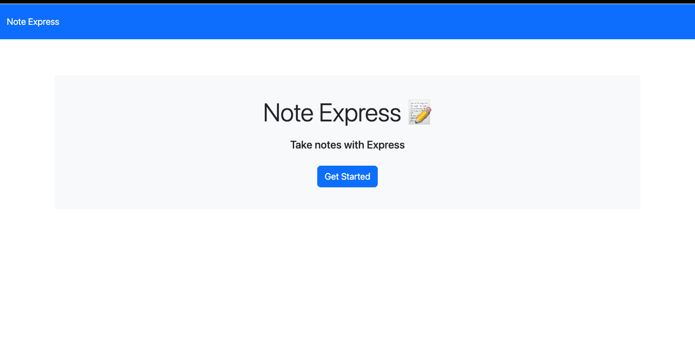

# note-express
A Note Taker application that can be used to write and save notes powered by Express.js
## Table of Contents

- [Description](#description)
- [User Story](#user-story)
- [Acceptance Criteria](#acceptance-criteria)
- [Preview Images](#preview-images) 
- [Link To Deployed site on Heroku](#link-to-deployed-site-on-heroku)
- [Installation and Usage](#installation-and-usage)
- [Tests](#tests)
- [Technologies Used](#technologies-used)
- [Credits](#credits)
- [License](#license)

## Descriptiom

An application called Note Express (Note Taker) that can be used to write and save notes. This application will uses Express.js back end and will save and retrieve note data from a JSON file. Each note is also given a unique ID using the UUID npm package.

The application will be invoked by using the following command:

```bash
node server.js
```

## User Story

```
AS A small business owner
I WANT to be able to write and save notes
SO THAT I can organize my thoughts and keep track of tasks I need to complete
```

## Acceptance Criteria

```
GIVEN a note-taking application
WHEN I open the Note Taker
THEN I am presented with a landing page with a link to a notes page
WHEN I click on the link to the notes page
THEN I am presented with a page with existing notes listed in the left-hand column, plus empty fields to enter a new note title and the note’s text in the right-hand column
WHEN I enter a new note title and the note’s text
THEN a Save icon appears in the navigation at the top of the page
WHEN I click on the Save icon
THEN the new note I have entered is saved and appears in the left-hand column with the other existing notes
WHEN I click on an existing note in the list in the left-hand column
THEN that note appears in the right-hand column
WHEN I click on the Write icon in the navigation at the top of the page
THEN I am presented with empty fields to enter a new note title and the note’s text in the right-hand column
```

## Preview Images
- ## Preview 1

- ## Preview 2


## Link To Deployed site on Heroku
**Walkthrough:** [Link To Deployed site on Heroku!](https://....) 


## Installation and Usage
- To clone the repo: https://github.com/cynthiamory/note-express.git
- Install [Node](https://nodejs.org/en). version 16 and up. Command line: npm init 
- Install the [Express package](https://www.npmjs.com/package/express). Command line: npm i express
- Then install [Uuid version 4](https://www.npmjs.com/package/uuidv4). Command line: npm i uuidv4
- Run the application using Command: node server.js

This application does not require any installation by the user. It can be used by simply following the live heroku link and then one can start creeating a new note using the "+" button. Once a new note has been given a title and description, it can be saved using the save icon and it will then be added to a list on the left hand side where it can be clicked on to be viewed again.

## Tests
- There are no tests yet for this application

## Technologies Used
Assignment was built with:
- JavaScript
- Express.js
- Uuidv4
- Node.js
- VS Code
- Heroku
- Github


## Credits
- Note Express: Cynthia Morales - Full Stack Developer Student
- Institution: The University Of Toronto
- Course: Bootcamp Full Stack Development
- Instructor: Ali Masqood
- Tutor: Jose Lopez 
- Learing Assistant Ask BCS Support: Jaytee aka JPadilla on slack
- License badges: Sheilds.io


## License

